# Development Workflow for Altera

Development using **Quartus Prime Lite** — Altera platform.

**Prerequisite:** Read [`quartus_install.md`](quartus_install.md) to install Quartus.

---

## 1. Create Project

1. Open **Quartus Prime Lite**
2. `File` → `New Project Wizard`
   
3. Configure:
   - **Project Name:** `blink`
   - **Project Directory:** ex. `C:\fpga\max_ii\blink\` or `/home/user/fpga/max_ii/blink/`
   - **Add Files to Project:** (leave blank for now)
   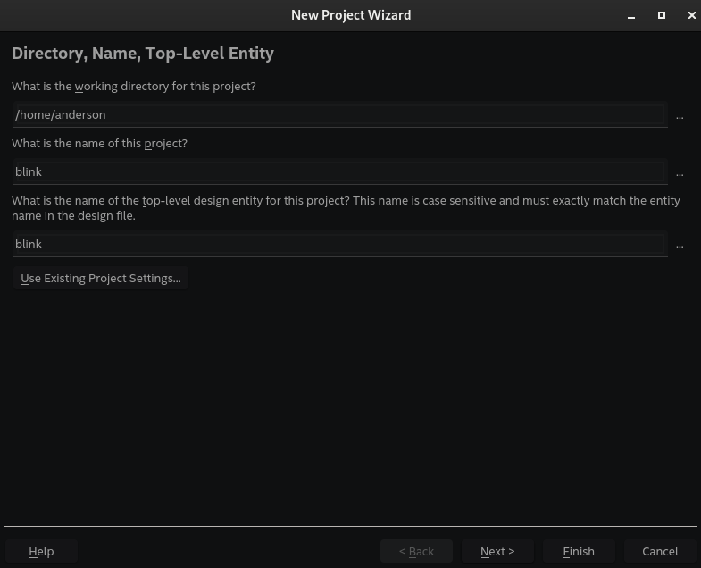
   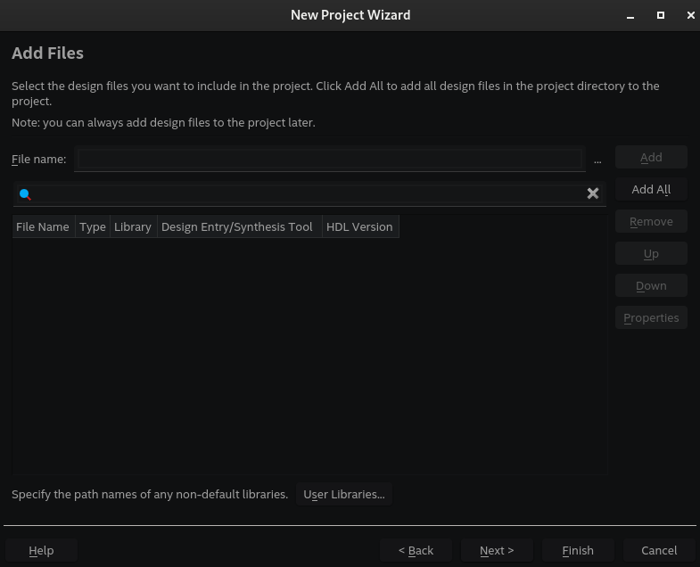
   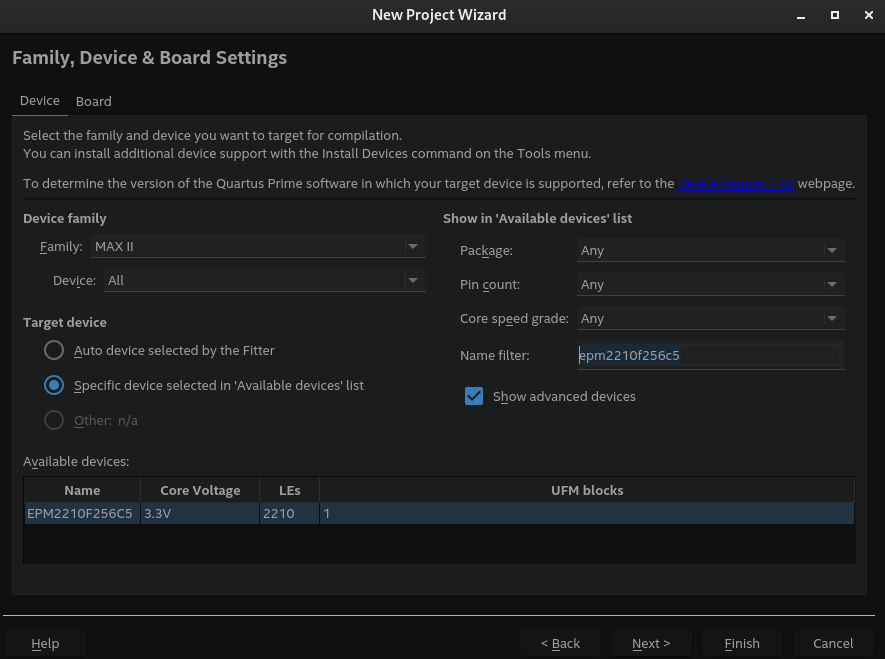
4. Click **Next**
5. Select MAX II device:
   - **Family:** MAX II
   - **Device:** EPM570T100C5 (or other compatible MAX II)
   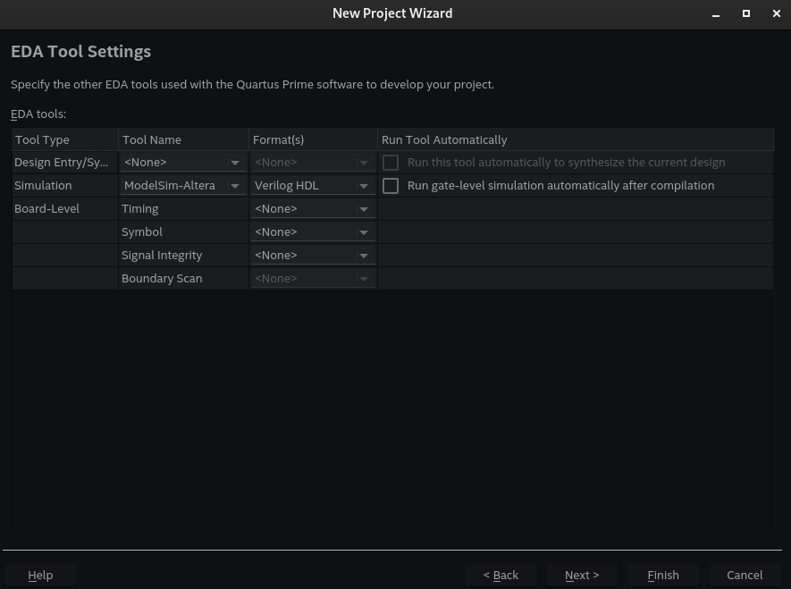
6. Click **Finish**
   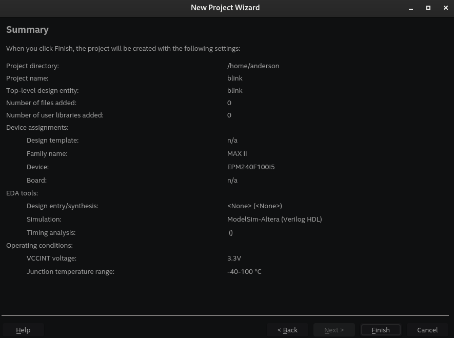


---

## 2. Create Verilog File

1. `File` → `New`
2. Select **Verilog HDL File**
3. Save as `top.v`
   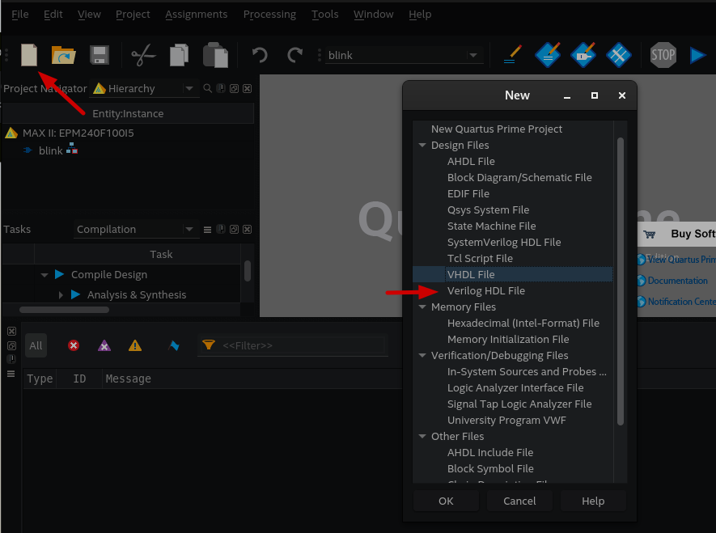
4. Write your Verilog module.
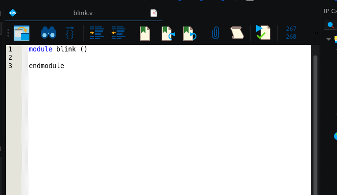
5. Adding external files: `File` → `Project` → `Add Files...`
6. Select `file.v` and click **Apply** and ok:

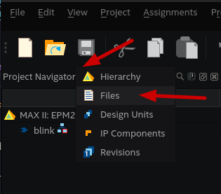

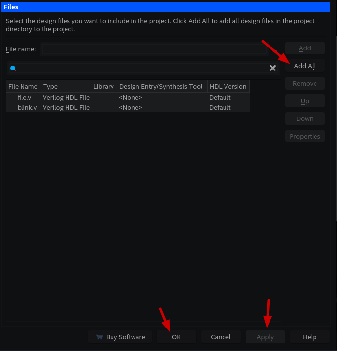
---

## 3. Synthesis

1. `Processing` → `Start Compilation`
2. Wait for compilation complete

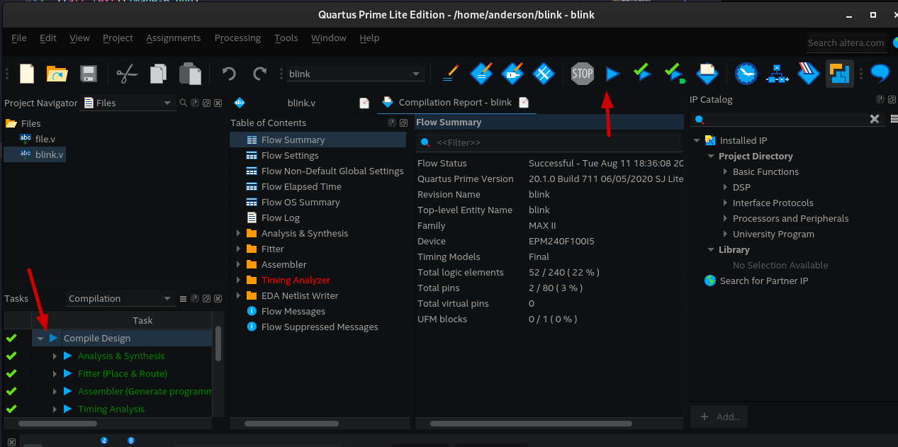
Success: No critical errors in **Messages** tab.

---

## 4. Physical Constraints (`.qsf`)

1. `Assignments` → `Pins`

2. Configure pins:

| Port Name | Pin # | IO Type |
|-----------|-------|---------|
| clk | (check board) | LVCMOS |
| led | (check board) | LVCMOS |

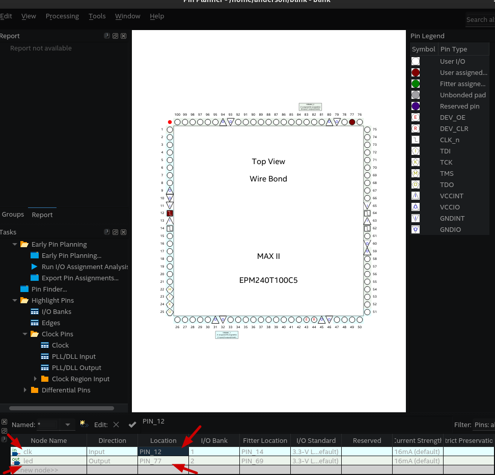

> **Note:** Pins depend on specific MAX II board. Verifique os esquemáticos originais da sua placa ou arquivos de pinagem (`.qsf` de exemplo) para identificar corretamente em qual pino o `clk` e os `leds` estão conectados.

3. Save project (Ctrl+S) and re-compile
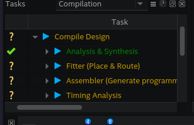

---

## 5. Place & Route

Already done during compilation (step 3)

---

## 7. Programming

1. Connect board via **USB Blaster**
2. `Tools` → `Programmer`

3. Click **Hardware Setup** and select USB Blaster port
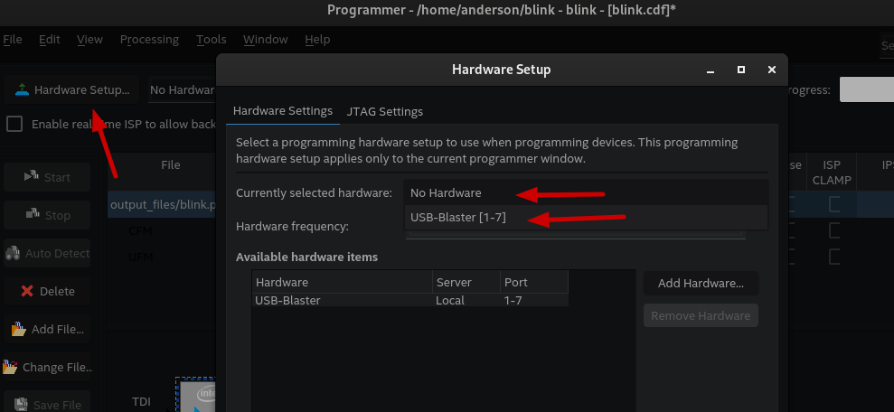
4. Click **Start** to program


### Programming via CLI (openFPGALoader)

Se você preferir gravar a placa via terminal utilizando o `openFPGALoader`, o Quartus Programmer precisará antes gerar um arquivo `.svf`.
1. No Programmer, vá em **File** → **Create/Update** → **Create JAM, SVF, or ISC File...**
2. Salve como formato `.svf`.
3. No terminal: `openFPGALoader -c usb-blaster projeto.svf`
*(Ou converta diretamente via terminal com: `quartus_cpf -c output_files/top.pof output_files/top.svf`)*

---

## Troubleshooting (Quartus)

### USB Blaster not appearing

```
Solution: 
- Check drivers on Windows (Zadig issue)
- On Linux, check if udev rules are properly configured (see [quartus_install.md](../toolchain_setup/quartus_install.md))
- Reconnect USB cable
- jtagconfig (list devices)
```

### Compilation errors

```
Solution: 
- Check pin names in Pin Planner
- Confirm correct MAX II device model is selected
- Review Verilog code syntax and logic
```
