# Development Workflow for Tang Nano

This document outlines two development workflows for the Gowin Tang Nano boards (1K, 9K, 20K):
1. **Gowin IDE (Windows):** Official GUI toolchain.
2. **oss-cad-suite (Cross-Platform):** Open-source toolchain (Yosys, nextpnr, openFPGALoader).

---

## Index

- [Development Workflow for Tang Nano](#development-workflow-for-tang-nano)
  - [Index](#index)
  - [1. Gowin IDE](#1-gowin-ide)
    - [1.1. Create Project](#11-create-project)
    - [1.2. Create Verilog File and Synthesis](#12-create-verilog-file-and-synthesis)
    - [1.3. Constraints and Programming](#13-constraints-and-programming)
  - [2. Open Source Toolchain (Cross-Platform)](#2-open-source-toolchain-cross-platform)
    - [Option A: Workflow via VS Code \& Lushay Code (Recommended)](#option-a-workflow-via-vs-code--lushay-code-recommended)
      - [2.1. Create a Project Folder](#21-create-a-project-folder)
      - [2.2. Initialize the Project](#22-initialize-the-project)
      - [2.3. Default Project Files](#23-default-project-files)
      - [2.4. Basic Constraints (`tang.cst`)](#24-basic-constraints-tangcst)
      - [2.5. Project Configuration (JSON)](#25-project-configuration-json)
      - [2.6. Toolchain Execution](#26-toolchain-execution)
  - [](#)
    - [Option B: Workflow via Makefile (CLI)](#option-b-workflow-via-makefile-cli)
      - [2.1. Project Structure](#21-project-structure)
      - [2.2. Complete Makefile](#22-complete-makefile)
      - [2.3. Development Flow](#23-development-flow)

---
## 1. Gowin IDE
### 1.1. Create Project

1. Open **Gowin FPGA Designer**
2. `File` → `New` → **FPGA Design Project** → OK
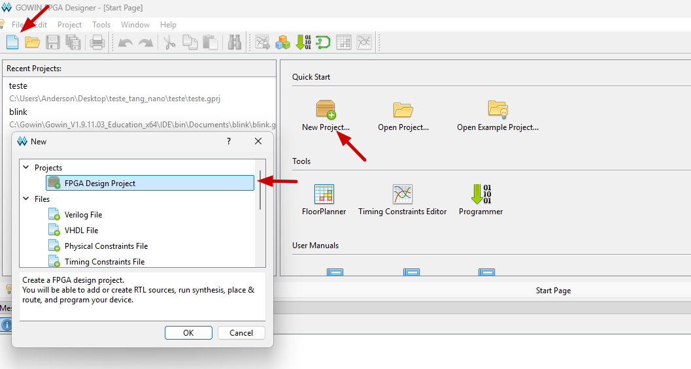
3. Configure Project Name and Path.
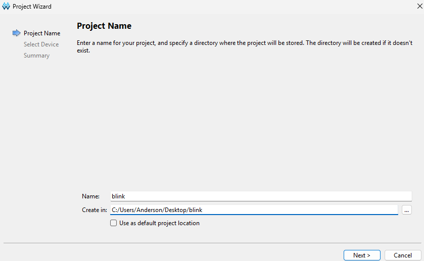
4. Select device (e.g., Series: GW1NZ, Device: GW1NZ-1, Package: QN48, Speed: C6/I5).
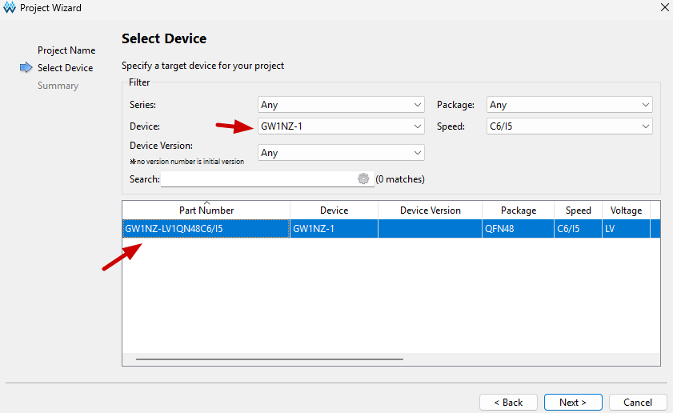
5. Click **Finish**.
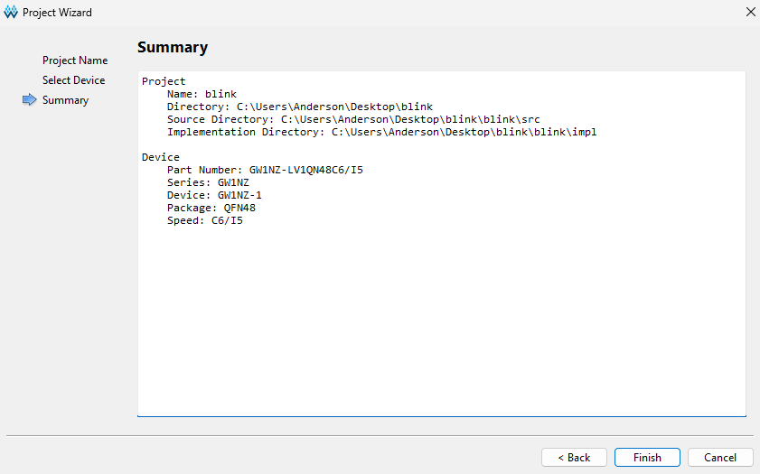

### 1.2. Create Verilog File and Synthesis

1. `File` → `New` → **Verilog File** → Save as `hdl.v`.
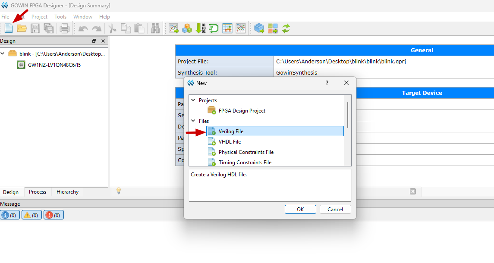
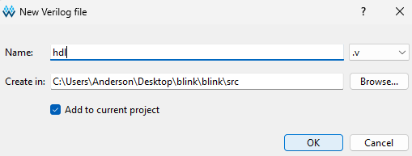
2. Write your HDL code.
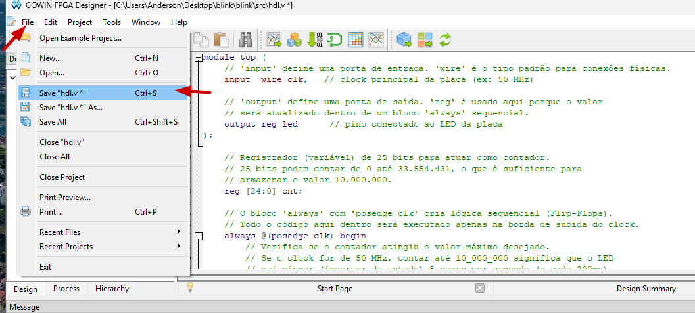
3. In the **Process** panel, double-click **Synthesize**.
4. Check for success in the terminal output.
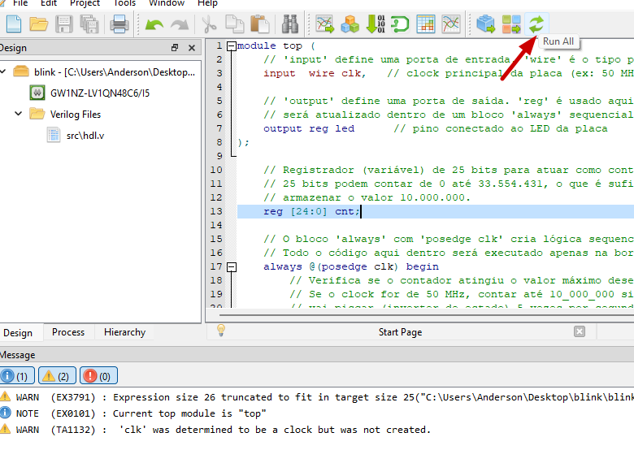

### 1.3. Constraints and Programming

1. Use the **Floorplanner** to map your Verilog ports to the physical pins of your board (generates `.cst` file).
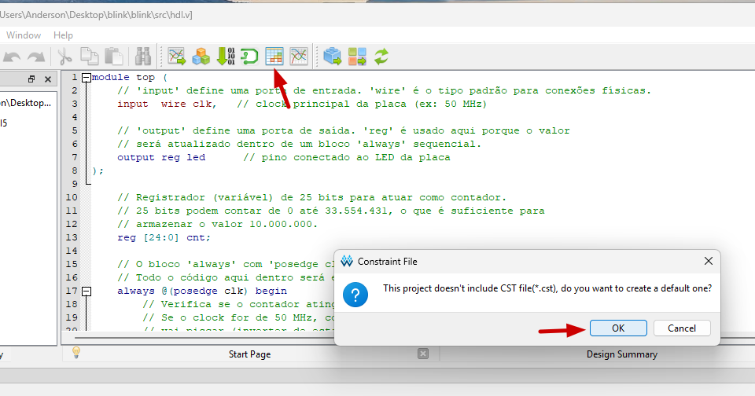
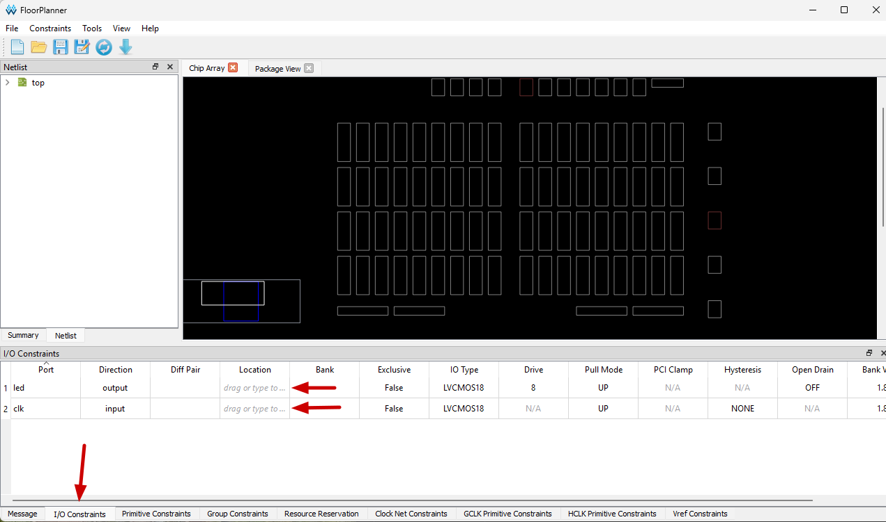
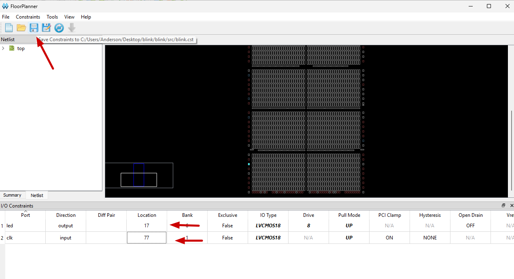
2. Double-click **Place & Route** in the Process panel.
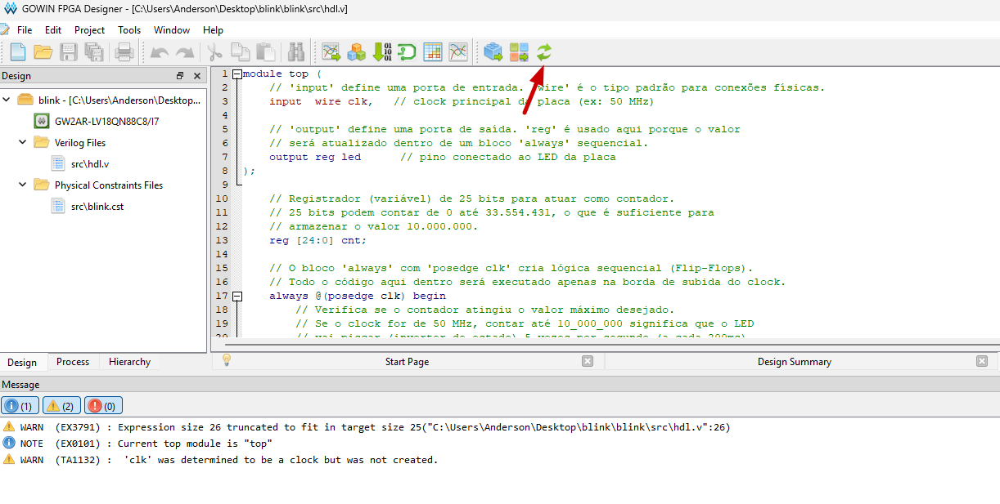
3. Double-click **Program Device**. Ensure the cable is detected as `USB Debugger A`.
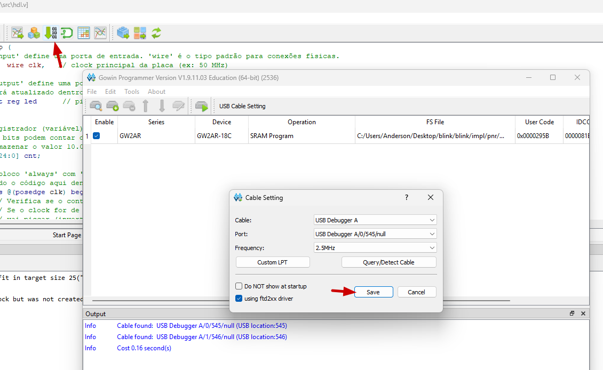
4. Run SRAM Program or Flash Program with your `.fs` bitstream file.
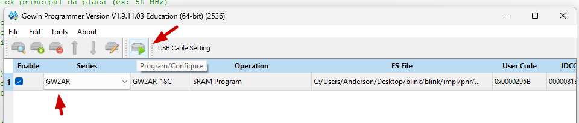
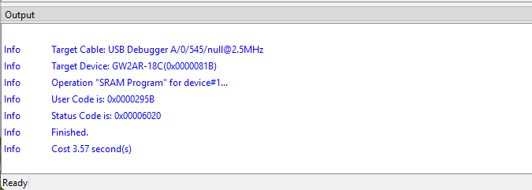

---

## 2. Open Source Toolchain (Cross-Platform)

**Prerequisite:** Install `oss-cad-suite` and the Lushay Code extension as detailed in [`suit_install.md`](suit_install.md).

### Option A: Workflow via VS Code & Lushay Code (Recommended)

This workflow utilizes the Lushay Code extension to automate project creation, synthesis, and programming.

#### 2.1. Create a Project Folder
Create an empty directory for your new project and open it in Visual Studio Code.
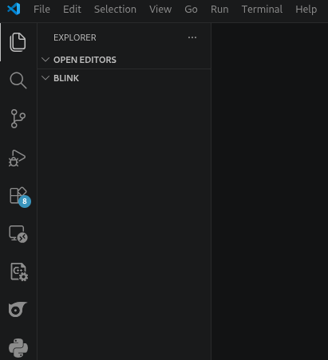

#### 2.2. Initialize the Project
- Click on the Lushay Code extension icon or open the Command Palette (`Ctrl+Shift+P`) to create a new project.
- **2.1.** Write the project name when prompted.
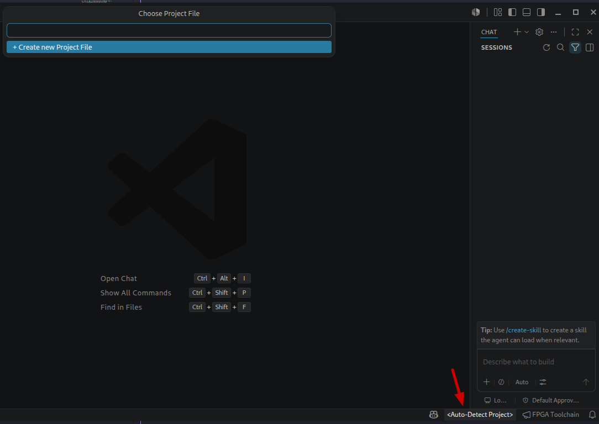
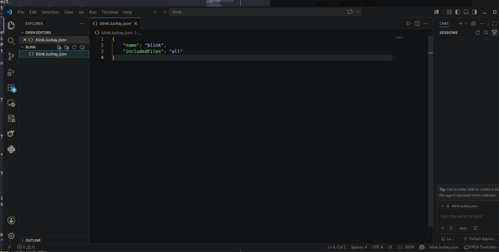

#### 2.3. Default Project Files
The extension needs a basic structure, including:
- `blink.v`: The main Verilog module (Top-Level) where you will write your hardware logic. Creates the new file with the.v extension;
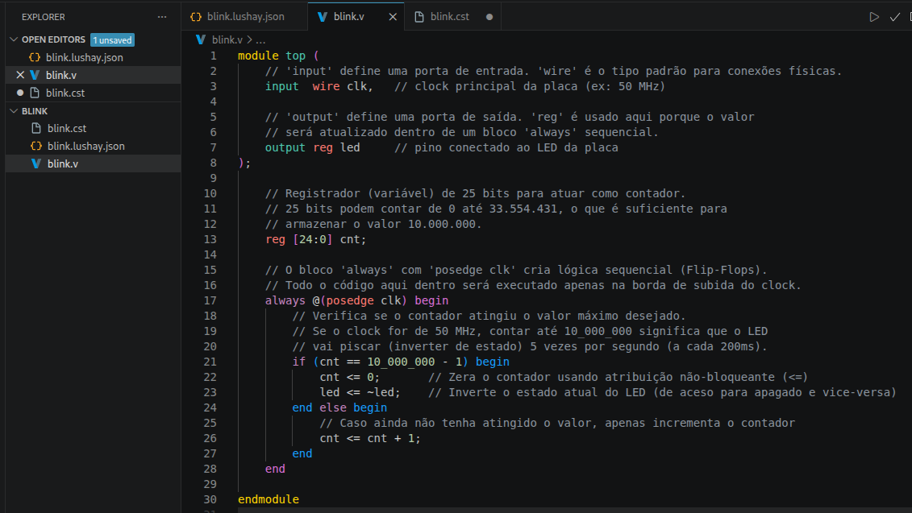
- `blink.cst`: The Physical Constraints file where you map the top-level Verilog ports (inputs/outputs) to the actual physical pins on the FPGA board. Creates the new file with the same name as the top level and with the .cst extension.
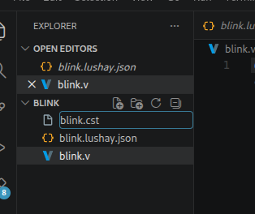
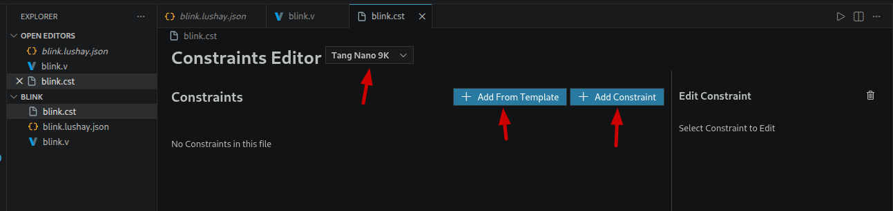

#### 2.4. Basic Constraints (`tang.cst`)
Depending on the version of your board, you can use the templates below to assist or use the visual environment that the extension provides, in which you can:

- Select board model;
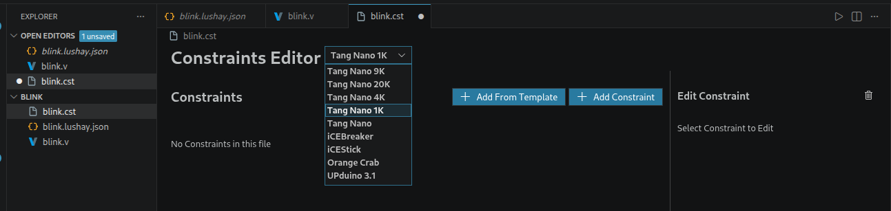
- Select a template from the pins;
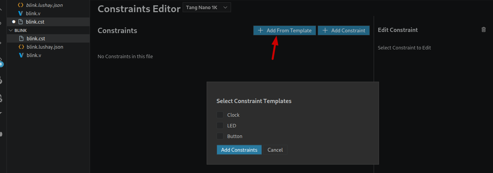
- Individually select which pins will be used and edit them.
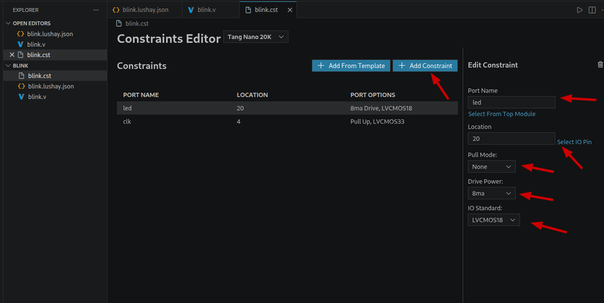

**Tang Nano 1K:**
```cst
IO_LOC "clk" 52;
IO_PORT "clk" IO_TYPE=LVCMOS33 PULL_MODE=UP;
```

**Tang Nano 9K:**
```cst
IO_LOC "clk" 52;
IO_PORT "clk" IO_TYPE=LVCMOS33 PULL_MODE=UP;
```

**Tang Nano 20K:**
```cst
IO_LOC "clk" 4;
IO_PORT "clk" IO_TYPE=LVCMOS33 PULL_MODE=UP;
```

#### 2.5. Project Configuration (JSON)
The extension relies on a JSON configuration file (e.g., `project.lushay.json`). Depending on your board version, structure your JSON as follows (using `blink` as the project name):

**Tang Nano 1K:**
```json
{
    "name": "blink",
    "project_name": "blink",
    "top_module": "top",
    "device": "GW1NZ-LV1QN48C6/I5",
    "board": "tangnano1k",
    "programMode": "ram",     // "programMode": "flash" | "ram";
    "includedFiles": ["blink.v"],
    "constraintFiles": ["blink.cst"]
}
```

**Tang Nano 9K:**
```json
{
    "name": "blink",
    "project_name": "blink",
    "top_module": "top",
    "device": "GW1NR-LV9QN88PC6/I5",
    "board": "tangnano9k",
    "programMode": "ram",     // "programMode": "flash" | "ram";
    "includedFiles": ["blink.v"],
    "constraintFiles": ["blink.cst"]
}
```

**Tang Nano 20K:**
```json
{
    "name": "blink",
    "project_name": "blink",
    "top_module": "top",
    "device": "GW2AR-LV18",
    "board": "tangnano20k",
    "programMode": "ram",     // "programMode": "flash" | "ram";
    "includedFiles": ["blink.v"],
    "constraintFiles": ["blink.cst"]
}
```

#### 2.6. Toolchain Execution
With a source file active, click on the Lushay Code toolchain menu. You will find the following options:
- **Compile:** Runs the toolchain to synthesize the design and generate the bitstream (`.fs`).
- **Run:** Uses openFPGALoader to program the previously generated bitstream to the board.
- **Compile and Run:** Performs the complete pipeline sequentially: synthesis, bitstream generation, and immediate FPGA programming.
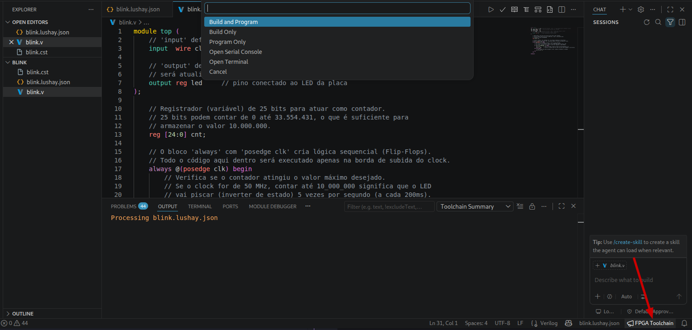
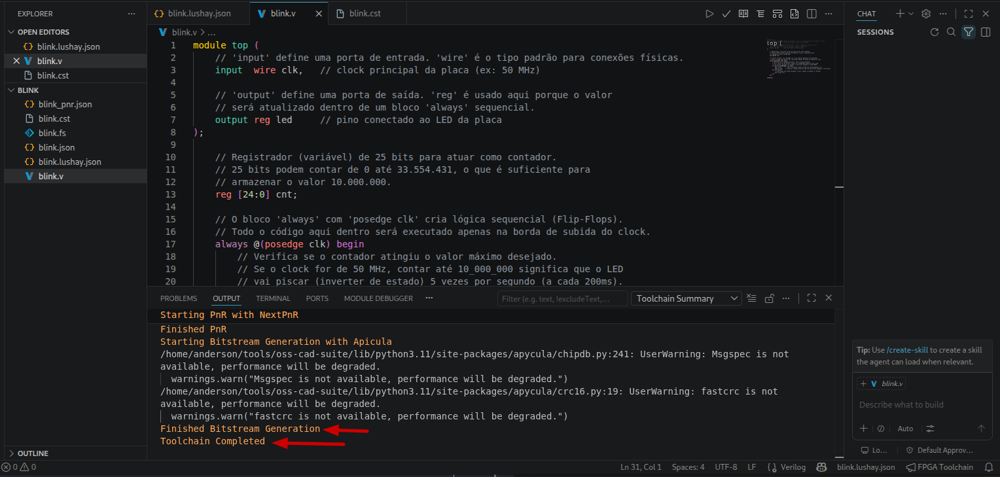
---

### Option B: Workflow via Makefile (CLI)

#### 2.1. Project Structure

Create your project folder and add a `Makefile` to automate the build process:

```
your_project/
├── Makefile
├── src/
│   └── top.v
└── constraints/
    └── pins.cst
```

#### 2.2. Complete Makefile

```makefile
# Gowin FPGA Build System

PROJECT := top
DEVICE := GW1NZ-1
FAMILY := GW1N
FPGA_BOARD := tangnano1k

VERILOG_FILES := src/top.v
CST_FILE := constraints/pins.cst

JSON_SYNTH := build/$(PROJECT).json
JSON_PNR := build/$(PROJECT)_pnr.json
BITSTREAM := build/$(PROJECT).fs

.PHONY: all synth pnr pack program clean

all: pack

synth: $(JSON_SYNTH)
$(JSON_SYNTH): $(VERILOG_FILES)
	mkdir -p build
	yosys -p "read_verilog $(VERILOG_FILES); synth_gowin -json $(JSON_SYNTH)"

pnr: $(JSON_PNR)
$(JSON_PNR): $(JSON_SYNTH) $(CST_FILE)
	nextpnr-gowin --device $(DEVICE) --cst $(CST_FILE) --json $(JSON_SYNTH) --write $(JSON_PNR)

pack: $(BITSTREAM)
$(BITSTREAM): $(JSON_PNR)
	gowin_pack -d $(DEVICE) -o $(BITSTREAM) $(JSON_PNR)

program: $(BITSTREAM)
	openFPGALoader -b $(FPGA_BOARD) $(BITSTREAM)

clean:
	rm -rf build/
```

#### 2.3. Development Flow

1. **Synthesis:** `make synth` (Uses Yosys to convert HDL to netlist).
2. **Place and Route:** `make pnr` (Uses nextpnr to place logic elements and route connections).
3. **Bitstream Generation:** `make pack` (Uses Apicula / gowin_pack to generate `.fs` file).
4. **Programming:** `make program` (Uses openFPGALoader to flash the board).

Check [`suit_install.md`](suit_install.md) for troubleshooting USB permissions and toolchain paths if commands fail.
